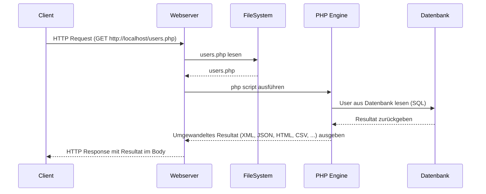

#### Webserver nicht statische Dateien, z.B. PHP (Ausblick Modul 295)

```mermaid
sequenceDiagram
    participant Client
    participant Webserver
    participant FileSystem
    participant PHP Engine
    participant Datenbank
    Client->>Webserver: HTTP Request (GET http://localhost/users.php)
    Webserver->>FileSystem: users.php lesen
    FileSystem-->>Webserver: users.php
    Webserver->>PHP Engine: php script ausführen
    PHP Engine->>Datenbank: User aus Datenbank lesen (SQL)
    Datenbank-->>PHP Engine: Resultat zurückgeben
    PHP Engine-->>Webserver: Umgewandeltes Resultat (XML, JSON, HTML, CSV, ...) ausgeben
    Webserver-->>Client: HTTP Response mit Resultat im Body
```